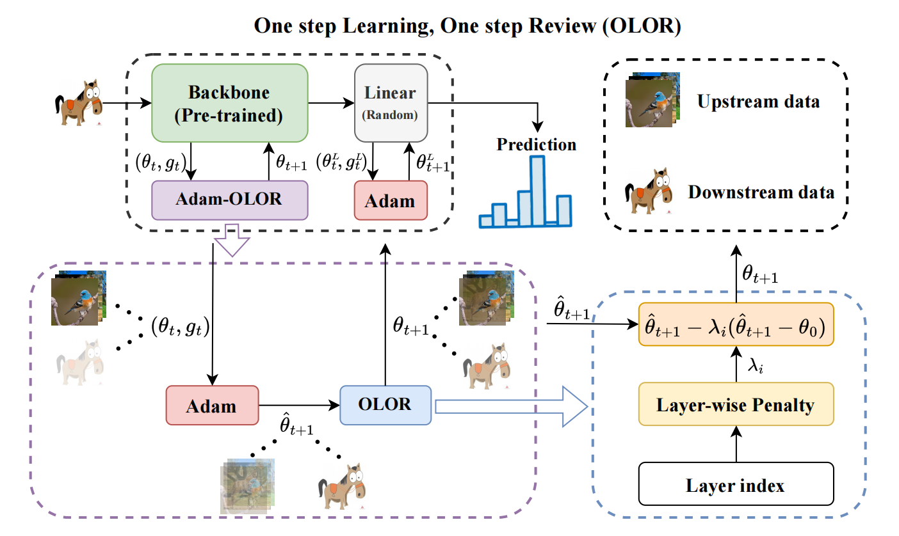

<div align="center">

# One Step Learning, One Step Review<br>(OLOR, AAAI 2024)

[](https://arxiv.org/abs/2401.10962)

</div>

OLOR is a weight rollback-based fine-tuning method for pre-trained vision models. It incorporates a weight rollback term into the weight update of the optimizer at each step, together with a layer-wise penalty that adjusts the rollback level across layers, alleviating knowledge forgetting during downstream adaptation.

## Algorithm

<div align="center">



</div>

We implement OLOR on top of two common optimizers:

| Optimizer | Base optimizer | Implementation |
|---|---|---|
| SGD-OLOR (`SGDB`) | SGD with momentum | [`OLOR/utils/SGDB.py`](OLOR/utils/SGDB.py) |
| Adam-OLOR (`AdamB`) | Adam | [`OLOR/utils/AdamB.py`](OLOR/utils/AdamB.py) |

## Installation

Clone this repository:

```bash
git clone git@github.com:xiaol827/OLOR.git
cd OLOR
```

Install the dependencies (Python >= 3.8 and PyTorch >= 2.0 with CUDA support are required, as the training script uses `torch.compile`):

```bash
pip install -r requirements.txt
```

## Data Preparing

**1. Download the datasets.** Our experiments cover the following benchmarks:

| Dataset | Task | Link |
|---|---|---|
| CIFAR-100 | General classification | [Download](https://www.cs.toronto.edu/~kriz/cifar.html) |
| SVHN | Digit classification | [Download](http://ufldl.stanford.edu/housenumbers/) |
| CUB-200 | Fine-grained classification | [Download](https://www.vision.caltech.edu/datasets/cub_200_2011/) |
| Stanford Cars | Fine-grained classification | [Download](https://www.kaggle.com/datasets/eduardo4jesus/stanford-cars-dataset) |
| Places-LT | Long-tailed classification | [Download](https://opendatalab.com/OpenDataLab/Places-LT) |
| IP102 | Pest classification | [Download](https://github.com/xpwu95/IP102) |
| OfficeHome | Domain generalization | [Download](https://www.hemanthdv.org/officeHomeDataset.html) |
| PACS | Domain generalization | [Download](https://sketchx.eecs.qmul.ac.uk/downloads/) |

**2. Convert annotations to CSVs.** Run [`Data_Preprocess.ipynb`](Data_Preprocess.ipynb) to convert the native annotations of each dataset into a unified CSV format with columns `image_path`, `label` and `fold`. Training sets are split into 10 stratified folds for cross-validation, while Places-LT and IP102 follow their official train/val splits.

**3. Feed the CSVs to the scripts.** The generated `*_train_10fold.csv` and `*_test.csv` files are passed to the training and testing scripts via `--csv-dir`.

## Usage

### Quick start

The OLOR optimizers are drop-in replacements for standard PyTorch optimizers:

```python
import timm
from OLOR.utils import AdamB

model = timm.create_model('vit_base_patch16_224', pretrained=True, num_classes=100)

optimizer = AdamB(
    model.parameters(),
    lr=1e-4,
    betas=(0.9, 0.999),
    pretrained=True,     # enable weight rollback for fine-tuning
    back_level_max=1,    # max rollback level (shallow layers)
    back_level_min=0,    # min rollback level (deep layers)
    back_pow=2,          # decay power of the layer-wise penalty
)

# standard training loop
for images, labels in dataloader:
    loss = criterion(model(images), labels)
    loss.backward()
    optimizer.step()
    optimizer.zero_grad()
```

Set `pretrained=False` to disable the rollback term, which recovers the vanilla base optimizer.

### Training

```bash
CUDA_VISIBLE_DEVICES=0 \
python -m torch.distributed.launch --nproc_per_node=1 \
./OLOR/train.py \
--finetune-mode AdamB \
--model-type vit \
--csv-dir ./CIFAR100/Cifar_100_train_10fold.csv \
--config-name 'config' \
--image-size 224 \
--epochs 50 \
--init-lr 1e-4 \
--batch-size 128 \
--num-workers 6 \
--nbatch_log 300 \
--warmup_epochs 0 \
--val_fold 0
```

### Testing

```bash
python ./OLOR/test.py \
--image-size 224 \
--csv-dir ./CIFAR100/Cifar_100_test.csv \
--model-path /path/to/checkpoint.pth
```

## Citation

If you find this work useful, please cite:

```bibtex
@inproceedings{huang2024one,
  title={One step learning, one step review},
  author={Huang, Xiaolong and Li, Qiankun and Li, Xueran and Gao, Xuesong},
  booktitle={Proceedings of the AAAI Conference on Artificial Intelligence},
  volume={38},
  number={11},
  pages={12644--12652},
  year={2024}
}
```
